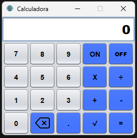

# Standard_Calculator

### Introdução 📝
* Projeto de uma calculaadora padrão feita em java, usando a ferramenta swing e o padrão de projeto MVC.

* Possui, além das 4 fundamentais, a operação de raiz quadrada. No teclado o atalho para raiz quadrada é a letra R.

<!--Tá obsoleto, mas o github so reconhece essa centralização-->

 

    

### Atualizações 16-07-2024

* **A quem puder interessar:** Olá pessoa que se interessou em acompanha esse projeto le trago boas novas !!!    
    Dei uma leve refatorada no código da calculadora e fico feliz em anunciar que ele está menos assemelhado  
    com a casa da *Mãe Joana*. Brincadeiras a parte, também aviso que novas features estão por vim só não  
    garanto quando, mas garanto que qualquer sujestão de melhoria será bem-vida.  Obrigado e apreciem sem moderação kkkk

